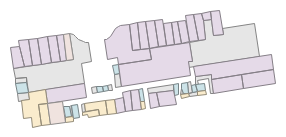

#### 项目介绍
高德地图插件，计算室内POI面积
效果：

#### 软件架构
软件架构说明

#### 安装教程

1. Anaconda 就行

#### 使用说明

1. 开启app.py，输入localhost:5000/<室内地图ID>，示例：http://localhost:5000/B02000IVH4

#### 参与贡献

1. 有问题可以联系 leitelyaya@sina.com